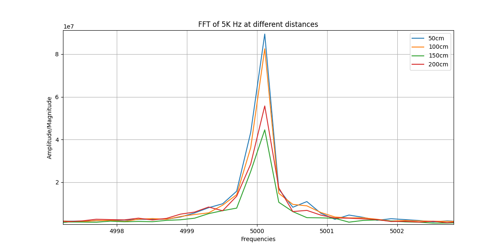

## OpenEar 
OpenEar is an open sourced project aimed at developing low-cost affordable hearing aids.

### Effect of distance of the source on ear piece
Out of number of challenges, one challenge which affects our project is: does loundness (or the amplitude) of sound diminishes with increasing distances from the mic (headset/ear pice).
The common sense says "YES", we know for sure, as we move away from the mic, sound diminishes - but by how much, or the most important question upto what distance we can hear the sound.

Hence we conducted an experiment, to measure the amplitude of a sound of 5000 Hz at different seperation from the mic: 50cm, 100cm, 150cm, 200cm (position of source from the mic) facing directly at the mic.

Used [https://onlinetonegenerator.com/](https://onlinetonegenerator.com/) to generate a monotone sound of 5 KHz (wav file)

### Supress self sound - Increase background non-noisy sounds
### Design audigram test app
### Use FFT to modulate frequency based on audio gram
### Transfer the whole setup to RPi Zero
### Ways to pair Rpi zero and Blutooth ear pieces (without screen)
